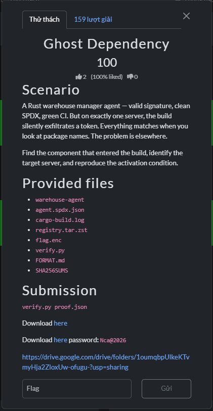

# Ghost Dependency



## Summary

The agent build looks clean in the supplied SPDX document, but the registry archive contains a different `telemetry-core 0.8.1` crate. Its build script injects a hidden value into the agent at compile time. The proof combines that crate's actual archive hash with the agent's selected host ID and an activation digest.

## Solution

### 1. Unpack both evidence bundles

`download.zip` contains the public handout, including the SPDX document, encrypted flag, verifier, and compressed registry. `player.7z` contains the Linux `warehouse-agent` and a second copy of the build evidence. The archive password shown with the challenge is `Nca@2026`.

```sh
python3 -m zipfile -e download.zip .
7z x player.7z -pNca@2026
```

The registry is Zstandard-compressed TAR. Extract it with the included helper:

```sh
python3 -m pip install zstandard
python3 extract.py
```

The helper writes the registry members under `extracted/registry/`. Each registry member is a gzip-compressed Cargo crate archive; the `telemetry-core` member is named `telemetry-core-0.8.1` without a `.crate` suffix.

### 2. Compare the actual crate to the SBOM

The SPDX document lists `telemetry-core` version `0.8.1` with SHA-256:

```text
80d433753b03c46eb8dd0c63ac60d7d22c2a3e91f2d652b5e9c073edf1e6d573
```

Hash the raw gzip crate member from the registry archive. Hashing the compressed member matters here: that is the crate archive whose digest the SPDX document claims.

```sh
sha256sum extracted/registry/telemetry-core-0.8.1
```

The actual digest is:

```text
00ebb39a81290e16cd8c6c677ba2ce3265021f940c0a6c37894720f98abdd463
```

This is the component that entered the build under the expected package name and version while its bytes disagree with the SBOM. Extract the crate itself to inspect its manifest and source:

```sh
mkdir -p extracted/telemetry-core
tar -xzf extracted/registry/telemetry-core-0.8.1 -C extracted/telemetry-core
```

The crate's `Cargo.toml` selects `build.rs`. That script contains:

```rust
let key: &[u8] = b"build-secret-rotation";
println!("cargo:rustc-env=EXFIL_PAYLOAD={}", hex::encode(key));
```

The build script encodes the secret and sets it as a compile-time environment variable for the agent. The crate manifest does not declare `hex`, while the accompanying cargo build log records `hex v0.4.3` being compiled. The library source also contains the marker `subverted core [cefdf53e]`; the same marker appears in the crate metadata and build script. These pieces explain why the mismatch is meaningful: the archive supplies build-time behavior absent from the clean source implied by its claimed digest.

The malicious `build.rs` SHA-256 is:

```text
9158c8946f2c738740da4dd83634b7e07537975b74a0a0eb54698d7150a15f91
```

### 3. Recover the selected host identity

Run the supplied ELF from a Linux environment (or WSL) in the extracted player handout directory:

```sh
cd player/handout
./warehouse-agent
```

It prints the selected host ID:

```text
host-39113c02654a
```

The host ID is runtime evidence from the agent. It is not inferred from the crate or chosen as a human-readable server name.

### 4. Compute the activation proof

The submission format defines the activation value as the lowercase hexadecimal SHA-256 of the UTF-8 text `crate_sha256:host_id`. Keep the colon between the two fields:

```python
import hashlib

crate_sha256 = "00ebb39a81290e16cd8c6c677ba2ce3265021f940c0a6c37894720f98abdd463"
host_id = "host-39113c02654a"
activation_hex = hashlib.sha256(
    f"{crate_sha256}:{host_id}".encode("utf-8")
).hexdigest()
print(activation_hex)
```

The result is:

```text
0a7d8a886e765c8bf794c66bde6e0beb107ffa9ab829b7ab74b4a531da665e1a
```

### 5. Assemble and verify `proof.json`

The short `handout/FORMAT.md` describes the three activation fields. The companion player bundle's `handout/SUBMISSION-FORMAT.md` also requires the hash of the malicious build-script snippet, so the accepted proof has four fields:

```json
{
  "activation_hex": "0a7d8a886e765c8bf794c66bde6e0beb107ffa9ab829b7ab74b4a531da665e1a",
  "crate_sha256": "00ebb39a81290e16cd8c6c677ba2ce3265021f940c0a6c37894720f98abdd463",
  "host_id": "host-39113c02654a",
  "malicious_snippet_sha256": "9158c8946f2c738740da4dd83634b7e07537975b74a0a0eb54698d7150a15f91"
}
```

After extracting `download.zip`, run the supplied verifier from this challenge directory:

```sh
python3 handout/verify.py proof.json
```

The verifier canonicalizes the JSON, derives its key, authenticates `flag.enc`, and prints the flag only when the proof is accepted.

## Flag

```text
CSCV2026{pr0v3nanc3_b34ts_4_trust3d_n4m3}
```
