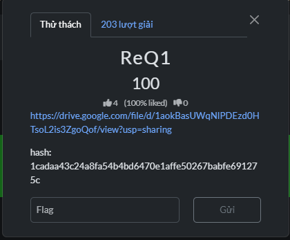

# ReQ1 — challenge intake

## Available information

- Category: reverse
- Points: 100
- Challenge download: [Google Drive](https://drive.google.com/file/d/1aokBasUWqNIPDEzd0HTsoL2i3zGoQof/view?usp=sharing)
- SHA-256 shown with the challenge: `1cadaa43c24a8fa54b4bd6470e1affe50267babfe691275c`

The ReQ1 challenge files and any solve artifacts are not present in this workspace, so a reproducible solution and flag cannot be documented yet. Add the downloaded handout to this folder and the writeup can be completed from the supplied files.
