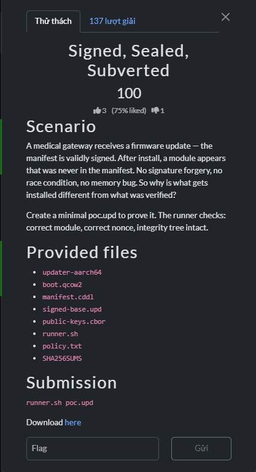

# Signed, Sealed, Subverted



## Summary

The updater validates a signed base manifest, then separately accepts a minimal patch that installs a module the signed manifest never named. The proof commits to the updater's build nonce and fixed module path.

## Solution

### Root cause

The valid Ed25519 signature in `signed-base.upd` authenticates only the 51-byte manifest text:

```text
CSCV-OTA-base-v7
root=/opt/recovery-root
version=7
```

It contains no module path, module digest, or build nonce. The updater's `emit` mode independently emits a `CSCV-PATCH v1` record with the fixed install path `/opt/modules/proof.mod`, the runtime `buildNonce`, and `len=0`. Applying that separate patch installs a module that the signed manifest never named: the trusted manifest and the installed patch are different objects.

### Construct the accepted patch

Running `updater-aarch64 emit` prints this exact 121-byte payload:

```text
CSCV-PATCH v1
nonce=be7f8504a8a5d232a6e88c67a4f47ecdab45d71427e11d653365ea34d147b15f
module=/opt/modules/proof.mod
len=0
```

The proof commitment is:

```json
{"build_nonce":"be7f8504a8a5d232a6e88c67a4f47ecdab45d71427e11d653365ea34d147b15f","module":"/opt/modules/proof.mod"}
```

The supplied runner accepted it with the patch as its payload and recovered the flag.

### Reproduce the proof

Extract `handout.zip` into `handout/` first. Then from the `SSS` challenge directory, run:

```sh
python3 -m zipfile -e handout.zip handout
sh ./handout/runner.sh ./proof.json ./poc.upd
```

The files are `proof.json` and `poc.upd` in this directory. `poc.upd` leaves `handout/boot.qcow2` unchanged.

The challenge prompt shows `runner.sh poc.upd`, but the supplied `handout/runner.sh` requires two arguments (`proof.json proof.mod`) and verifies the proof commitment. The reproduction above follows the checked-in runner's actual interface.

## Flag

```text
CSCV2026{v3rify_th3_s4m3_obj3ct_y0u_1nst4ll}
```
