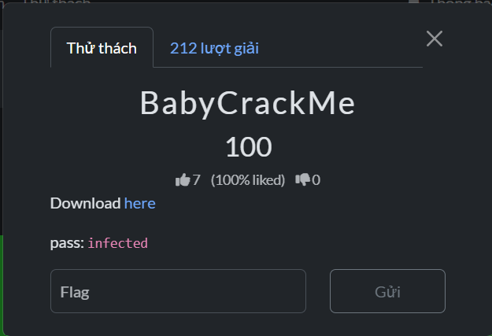

# BabyCrackMe



## Summary

The supplied Windows PE is a small loader containing a second PE image. I mapped the outer file, found the embedded program, restored the embedded PE's overwritten signature bytes, and parsed its imports and IAT. The password checker then yielded to static analysis: its target is assembled from instruction immediates, AES-decrypted, and passed through a reversible bit permutation. That password decrypts the PNG with the flag.

## Solution

### 1. Unpack the challenge and identify the two PE layers

The archive is password protected with `infected`. Extract it and inspect `chall.exe` with a PE parser or a PE viewer:

```powershell
7z x .\BabyCrackme.7z -pinfected -oextracted
```

The outer PE has `ImageBase = 0x140000000`, entry RVA `0x1000`, and four sections. Its import directory is empty (`RVA=0`, `size=0`). The `.data` section starts at RVA `0x3000`, has size `0x6a00`, and begins at raw file offset `0xe00`. This is where the second image is stored.

After mapping the outer PE into memory, bytes `0x3000..0x99ff` are the embedded image. The inner header has the expected layout, but its two identifying signatures were overwritten: offset `0` does not begin with `MZ`, and offset `0x100` does not begin with `PE\0\0`. The remaining DOS/NT fields and section table are intact. Restoring those four signature bytes makes the embedded PE parseable; this step changes only an analysis buffer.

### 2. Recover the embedded PE's imports and IAT

The IAT is not in the outer PE. It belongs to the embedded PE. This snippet recreates that image in memory and asks `pefile` to parse its import descriptors:

```python
import pefile

outer = pefile.PE("extracted/Challenge1/chall.exe")
mapped = outer.get_memory_mapped_image()
inner_bytes = bytearray(mapped[0x3000:0x3000 + 0x6A00])
inner_bytes[0:2] = b"MZ"
inner_bytes[0x100:0x104] = b"PE\0\0"
inner = pefile.PE(data=bytes(inner_bytes))

base = inner.OPTIONAL_HEADER.ImageBase
for descriptor in inner.DIRECTORY_ENTRY_IMPORT:
    print(descriptor.dll.decode(), hex(descriptor.struct.FirstThunk))
    for symbol in descriptor.imports:
        name = symbol.name.decode() if symbol.name else f"ordinal {symbol.ordinal}"
        print(f"  IAT RVA {symbol.address - base:#x}: {name}")
```

The inner import directory is at RVA `0x6334` with size `0xf0`. Its IAT directory is at RVA `0x5000` with size `0x2f0`, inside the oddly named `.nuhuh` section. `OriginalFirstThunk` points to the import-name table; `FirstThunk` points to the corresponding IAT slots. The parser pairs each slot with its DLL and function name. It finds 11 DLL descriptors and 83 named imports. With one null terminator per descriptor, that is 94 eight-byte slots, exactly `94 * 8 = 0x2f0` bytes.

| DLL | Import count | First IAT RVA | Useful clue |
|---|---:|---:|---|
| `KERNEL32.dll` | 16 | `0x5000` | file and process APIs |
| `MSVCP140.dll` | 18 | `0x5088` | C++ stream/runtime calls |
| `bcrypt.dll` | 11 | `0x5290` | `BCryptDecrypt` and related crypto APIs |
| `VCRUNTIME140_1.dll` | 1 | `0x5178` | C++ exception runtime |
| `VCRUNTIME140.dll` | 10 | `0x5120` | C runtime helpers |
| `api-ms-win-crt-heap-l1-1-0.dll` | 4 | `0x5188` | heap allocation |
| `api-ms-win-crt-runtime-l1-1-0.dll` | 18 | `0x51d0` | process/runtime setup |
| `api-ms-win-crt-math-l1-1-0.dll` | 1 | `0x51c0` | math runtime |
| `api-ms-win-crt-stdio-l1-1-0.dll` | 2 | `0x5268` | standard I/O |
| `api-ms-win-crt-locale-l1-1-0.dll` | 1 | `0x51b0` | locale setup |
| `api-ms-win-crt-string-l1-1-0.dll` | 1 | `0x5280` | string helper |

This is static IAT recovery: the inner PE already contains its import descriptors and thunk tables, so restoring its header signatures lets the parser display the mappings. I did not manually resolve runtime function addresses or patch the outer executable. The password solver below never executes the inner PE; the import listing helped identify its crypto and file-handling code.

The IAT snippet requires `pefile` (`python -m pip install pefile`). The included solver itself only requires `cryptography`.

### 3. Find how the password check is built

The embedded `.text` begins at inner raw offset `0x400`. Since the inner image itself begins at outer raw offset `0xe00`, its first relevant instructions are at outer file offset `0xe00 + 0x400 = 0x1200`. The input checker and success/failure strings are in the embedded image, so I used string references and disassembly to follow the checker rather than execute the packed loader.

At file offset `0x1200`, the first helper contains repeated x86-64 instructions of the form:

```text
C7 45 <disp8> <imm32>
```

`C7 /0` is `mov r/m32, imm32`; ModRM byte `45` selects `[rbp + disp8]`. The helper's 80-byte local buffer begins at `[rbp-0x50]`, so an instruction with signed displacement `d` writes four bytes at buffer offset `d + 0x50`. The immediate is little endian. The solver scans the 0xa1-byte helper, places each immediate at that offset, and tracks written byte positions. The coverage assertion checks that all 80 bytes were recovered without gaps or overlaps.

The byte array has this layout:

```text
bytes  0..31: AES-256 key
bytes 32..79: 48-byte AES-CBC ciphertext
```

The IV is packed from adjacent key nibbles:

```python
iv[j] = (key[2*j] & 0xf0) | (key[2*j + 1] & 0x0f)
```

Decrypting with AES-256-CBC and removing PKCS#7 padding produces a 32-byte target. The target is the checker's transformed version of the expected password.

### 4. Invert the checker transform

The checker handles eight input bytes at a time. For output byte `o`, output bit `7-b` is copied from input byte `(o+b) mod 8`, at the same bit position. The operation only permutes bits, so the inverse scatters each output bit back to its source byte:

```python
for output_index, value in enumerate(target_block):
    for bit in range(8):
        source_index = (output_index + bit) & 7
        recovered[source_index] |= value & (0x80 >> bit)
```

Repeating this for four blocks recovers the 32-byte password. The solver applies the forward transform again and asserts that the result equals the decrypted target; this checks the direction and indexing of the inverse. The recovered password is:

```text
y0u_4r3_ju5t_t00_g00d_t0_b3_tru3
```

### 5. Decrypt and validate the flag image

The file-decryption routine derives its AES-256 key as `SHA256(password)`. It builds the IV from adjacent digest nibbles using the same rule, decrypts `flag.png.enc` with AES-CBC, and removes PKCS#7 padding. The solver verifies both the PNG header (`89 50 4e 47 0d 0a 1a 0a`) and the final `IEND` chunk before saving the image. Reading that image gives the flag.

Run the included solver after extracting the archive. It needs Python 3 and `cryptography` (`python -m pip install cryptography`):

```powershell
python .\solve_baby.py
```

## Flag

```text
CSCV2026{n0_IAT_HuH???}
```
